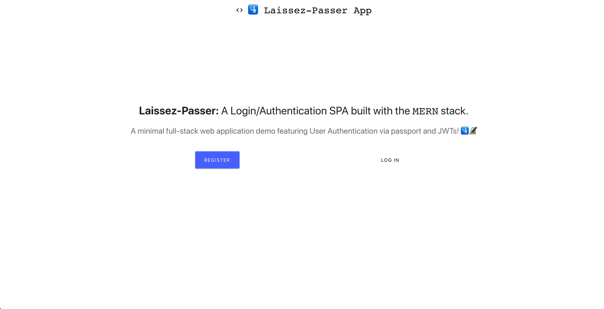

# 🛂 Laissez-Passer App

A minimal MERN full-stack app showcasing User Authentication using Passport and JWTs.



## Technologies & Frameworks

- [Create React App](https://facebook.github.io/create-react-app/)
- [React](https://reactjs.org/)
- [Express](https://expressjs.com/)
- [Redux](https://redux.js.org/)
- [Passport](http://www.passportjs.org/)
- [JWT](https://jwt.io/)
- [Docker](https://www.docker.com/)
- [Travis CI](https://travis-ci.org/)
- [MongoDB](https://www.mongodb.com/)
- [Node.js](https://nodejs.org/en/)
- [Nginx](https://www.nginx.com)

## Overview

This application utilizes the following technologies in the respecive areas:

- **Frontend:** React
- **Backend:** Express & Node
- **Database:** MongoDB
- **State Management:** Redux
- **Authentication:** Passport, JWTs
- **DevOps Management:** Docker, Travis CI
- **Loadbalancing:** Nginx
- **Deployment Environment(s):** AWS, but can also use Azure or GCP

## Quickstart

```javascript
// Install dependencies for server & client
npm install && npm run client-install

// Run client & server with concurrently
npm run dev

// Server runs on http://localhost:5000 and client on http://localhost:3000
```
